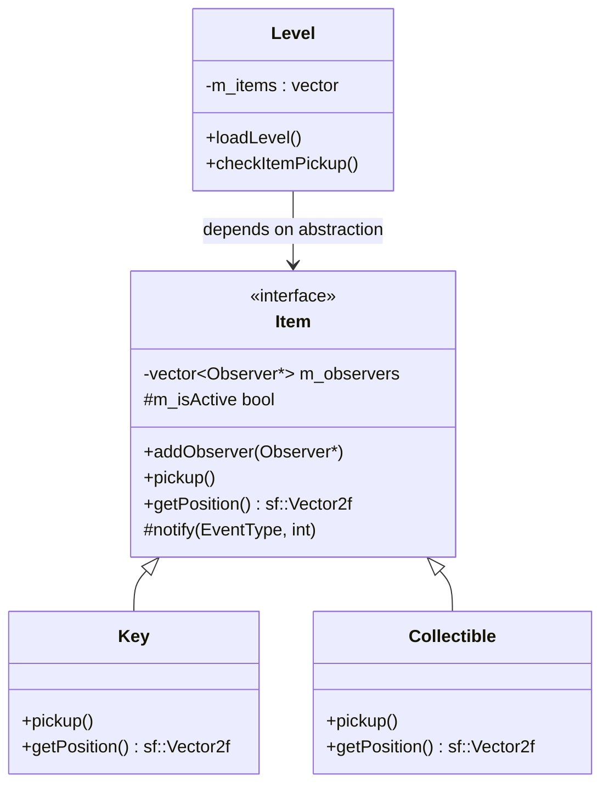

```mermaid
classDiagram
    class Level {
        -m_items : vector<Item*>
        +loadLevel()
        +checkItemPickup()
    }

    class Item {
<<interface>>
        -vector~Observer*~ m_observers
        +addObserver(Observer*)
        +pickup()
        +getPosition() sf::Vector2f
        #notify(EventType, int)
        #m_isActive bool
    }

    class Collectible {
        +pickup()
        +getPosition() sf::Vector2f
    }

    class Key {
        +pickup()
        +getPosition() sf::Vector2f
    }

    Level --> Item : depends on abstraction
    Item <|-- Key
    Item <|-- Collectible
```
