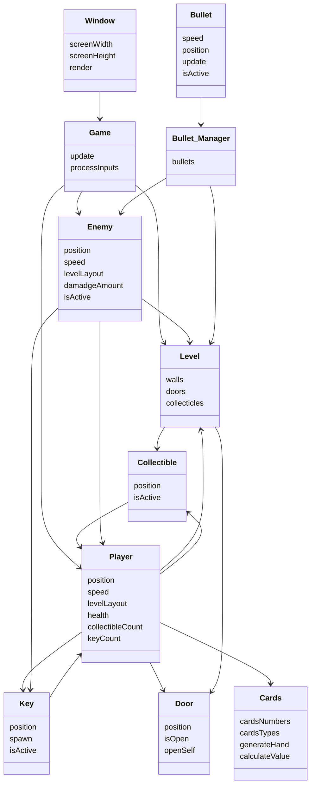

```mermaid
classDiagram
  class Window {
    screenWidth
    screenHeight
    render
}

  class Game {
    update
    processInputs
}

  class Collectible {
    position
    isActive
}

  class Cards {
    cardsNumbers
    cardsTypes
    generateHand
    calculateValue
}

  class Player {
    position
    speed
    levelLayout
    health
    collectibleCount
    keyCount
}

  class Enemy {
    position
    speed
    levelLayout
    damadgeAmount
    isActive
}

class Bullet_Manager {
    bullets
}

  class Bullet {
    speed
    position
    update
    isActive
}

  class Level {
    walls
    doors
    collecticles
}

  class Door {
    position
    isOpen
    openSelf
}

  class Key {
    position
    spawn
    isActive
}


Window-->Game

Game-->Level
Game-->Player
Game-->Enemy

Collectible-->Player

Player-->Level
Player-->Key
Player-->Door
Player-->Collectible
Player-->Cards

Enemy-->Level
Enemy-->Player
Enemy-->Key

Bullet-->Bullet_Manager

Bullet_Manager-->Level
Bullet_Manager-->Enemy

Level-->Collectible
Level-->Door

Key-->Player
```
