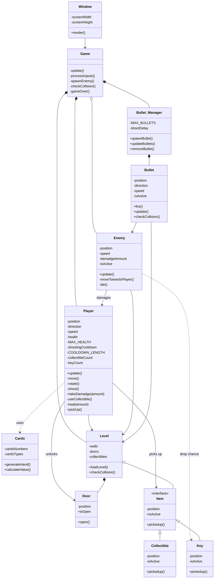

```mermaid
classDiagram
  class Window {
    -screenWidth
    -screenHeight

    +render()
}

  class Game {

    -update()
    -processInputs()
    -spawnEnemy()
    -checkCollision()
    -gameOver()
}

  class Player {
    -position
    -direction
    -speed
    -health
    -MAX_HEALTH
    -shootingCooldown
    -COOLDOWN_LENGTH
    -collectibleCount
    -keyCount

    +update()
    -move()
    -rotate()
    -shoot()
    +takeDamadge(amount)
    -useCollectible()
    -heal(amount)
    +pickUp()
}

  class Cards {
    -cardsNumbers
    -cardsTypes

    +generateHand()
    +calculateValue()
}

  class Enemy {
    -position
    -speed
    -damadgeAmount
    -isActive

    +update()
    -moveTowardsPlayer()
    -die()
}

class Bullet_Manager {
    -MAX_BULLETS
    -shootDelay

    +spawnBullet()
    +updateBullets()
    +removeBullet()
}

  class Bullet {
    -position
    -direction
    -speed
    -isActive

    +fire()
    +update()
    +checkCollision()
}

  class Level {
    -walls
    -doors
    -collectibles

    +loadLevel()
    +checkCollision()
}

  class Door {
    -position
    +isOpen

    +open()
}

  class Item {
<<interface>>
    -position
    +isActive

    +pickedup()
}

  class Key {
    -position
    -isActive

    +pickedup()
}

class Collectible {
    -position
    -isActive

    +pickedup()
}


Window --> Game

Game *-- Level
Game *-- Player
Game o-- Enemy
Game *-- Bullet_Manager

Player --> Level
Player --> Door : unlocks
Player --> Item : picks up
Player ..> Cards : uses

Enemy --> Level
Enemy --> Player : damages
Enemy ..> Key : drop chance

Bullet_Manager *-- Bullet

Bullet --> Enemy
Bullet --> Level

Level *-- Door
Level o-- Item

Item <|-- Key
Item <|-- Collectible
```
