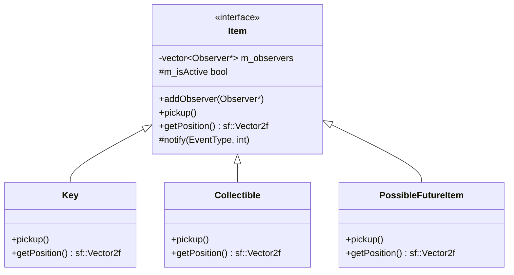

```mermaid
classDiagram
    class Item {
        <<interface>>
        -vector~Observer*~ m_observers
        +addObserver(Observer*)
        +pickup()
        +getPosition() sf::Vector2f
        #notify(EventType, int)
        #m_isActive bool
    }

   class Collectible {
        +pickup()
        +getPosition() sf::Vector2f
    }

    class Key {
        +pickup()
        +getPosition() sf::Vector2f
    }

    class PossibleFutureItem {
        +pickup()
        +getPosition() sf::Vector2f
    }

    Item <|-- Key
    Item <|-- Collectible
    Item <|-- PossibleFutureItem
```
