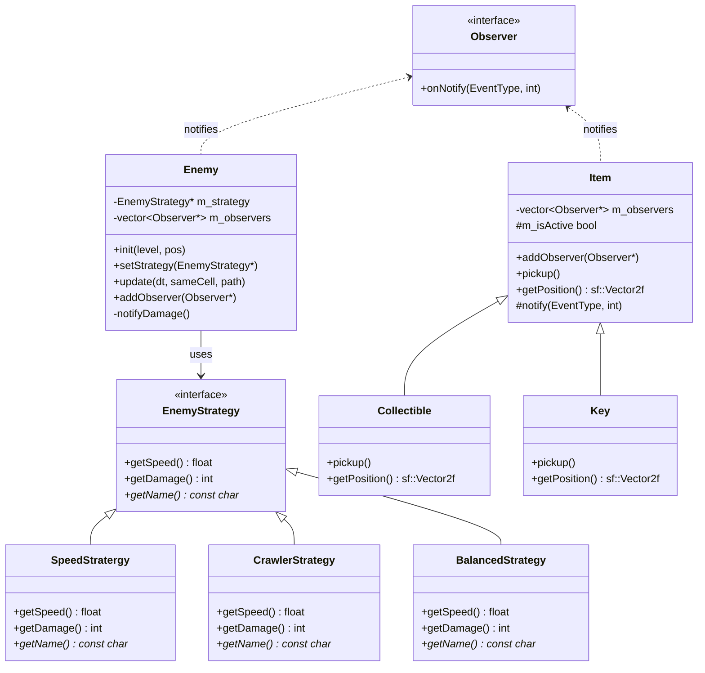

```mermaid
classDiagram
    class EnemyStrategy {
        <<interface>>
        +getSpeed() float
        +getDamage() int
        +getName() const char*
    }

    class SpeedStratergy {
        +getSpeed() float
        +getDamage() int
        +getName() const char*
    }

    class CrawlerStrategy {
        +getSpeed() float
        +getDamage() int
        +getName() const char*
    }

    class BalancedStrategy {
        +getSpeed() float
        +getDamage() int
        +getName() const char*
    }

    class Enemy {
        -EnemyStrategy* m_strategy
        -vector~Observer*~ m_observers
        +init(level, pos)
        +setStrategy(EnemyStrategy*)
        +update(dt, sameCell, path)
        +addObserver(Observer*)
        -notifyDamage()
    }

    EnemyStrategy <|-- SpeedStratergy
    EnemyStrategy <|-- CrawlerStrategy
    EnemyStrategy <|-- BalancedStrategy

    Enemy --> EnemyStrategy : uses


    class Observer {
        <<interface>>
        +onNotify(EventType, int)
    }

    class Item {
        -vector~Observer*~ m_observers
        +addObserver(Observer*)
        +pickup()
        +getPosition() sf::Vector2f
        #notify(EventType, int)
        #m_isActive bool
    }

    class Collectible {
        +pickup()
        +getPosition() sf::Vector2f
    }

    class Key {
        +pickup()
        +getPosition() sf::Vector2f
    }

    Observer <.. Item : notifies
    Observer <.. Enemy : notifies

    Item <|-- Collectible
    Item <|-- Key
```
